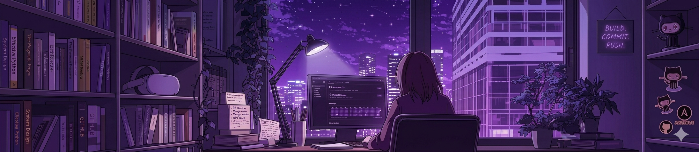

  

## 🧠 My Focus Areas
- Frontend Development

## 📊 GitHub Stats & Trophies

  
  

  

  

## 🛠️ Languages & Tools

> ## Programming Languages

   

> ## Frontend

  

> ## Tools

  

<!-- 

  

 -->

## 🔗 Connect with Me

